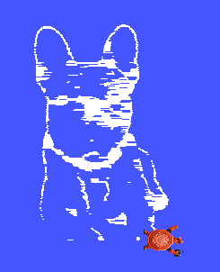

# Turtle Draw — Documentação Técnica

## Visão Geral

Este projeto implementa uma pipeline completa de visão computacional que lê uma imagem, extrai seus contornos e controla a tartaruga do **Turtlesim** (via ROS 2) para reproduzir esses contornos na tela. Toda a cadeia — do processamento da imagem até o controle do robô.

A arquitetura é dividida em dois módulos principais:

| Módulo | Arquivo | Responsabilidade |
|---|---|---|
| Visão Computacional | `imagem_processing.py` | Pré-processamento, detecção de bordas e mapeamento de coordenadas |
| Controle ROS 2 | `turtle_draw_node.py` | Nó ROS 2 que comanda a tartaruga via serviços |

---

## Pipeline de Visão Computacional

### Etapa 1 — Carregamento da Imagem

```python
img_bgr = cv2.imread(caminho_arquivo)
img_rgb = img_bgr[:,:,::-1]
```

O OpenCV carrega imagens no formato BGR por padrão. A inversão dos canais (`[:,:,::-1]`) converte para RGB, que é a convenção padrão para processamento subsequente.

---

### Etapa 2 — Conversão para Escala de Cinza

```python
img_cinza = (0.299 * R + 0.587 * G + 0.114 * B).astype(np.float64)
```

A conversão para tons de cinza é necessária porque a detecção de bordas opera sobre intensidade luminosa, não cor. Os coeficientes `0.299`, `0.587` e `0.114` (ponderação ITU-R BT.601) refletem a sensibilidade do olho humano a cada canal: o verde contribui mais, seguido do vermelho e, por último, do azul.

**Justificativa:** Manter o canal de cor seria redundante para extração de bordas e triplicaria o custo computacional. A ponderação perceptual preserva melhor o contraste visual que uma média simples (1/3, 1/3, 1/3).

---

### Etapa 3 — Suavização Gaussiana (Blur)

A suavização é aplicada via **convolução manual** com um kernel gaussiano 5×5:

```python
kernel_gaussiano = np.array([
    [1, 4, 7, 4, 1],
    [4, 16, 26, 16, 4],
    [7, 26, 41, 26, 7],
    [4, 16, 26, 16, 4],
    [1, 4, 7, 4, 1]
]) / 273.0
```

A função `aplicar_convolucao` realiza a operação com **padding de borda** (`mode='edge'`) para evitar artefatos nas extremidades da imagem.

**Justificativa:** O Filtro de Sobel (próxima etapa) é muito sensível a ruído — pequenas variações de pixel geram bordas espúrias. O blur gaussiano atenua essas variações de alta frequência antes da detecção, resultando em bordas mais limpas e contínuas.

---

### Etapa 4 — Detecção de Bordas com Filtro de Sobel

O Sobel é aplicado separadamente nos eixos X e Y:

```python
sobel_x = np.array([[-1, 0, 1], [-2, 0, 2], [-1, 0, 1]])
sobel_y = np.array([[-1, -2, -1], [0, 0, 0], [1, 2, 1]])

grad_x = aplicar_convolucao(img_suavizada, sobel_x)
grad_y = aplicar_convolucao(img_suavizada, sobel_y)
magnitude = np.sqrt(grad_x**2 + grad_y**2)
```

A magnitude do gradiente indica a intensidade da borda em cada pixel. Em seguida, aplica-se um **threshold**:

```python
bordas = np.where(magnitude > 60, 255, 0).astype(np.uint8)
```

**Justificativa:** O operador de Sobel calcula a derivada direcional da imagem — regiões de mudança abrupta de intensidade (bordas) produzem gradientes elevados. O threshold de `60` foi escolhido empiricamente para equilibrar completude do contorno e eliminação de ruído de fundo. Valores menores capturavam textura desnecessária; valores maiores quebravam a continuidade das bordas.

---

### Etapa 5 — Mapeamento para o Espaço do Turtlesim

```python
linhas_y, colunas_x = np.where(bordas == 255)
linhas_y = alt_img - linhas_y  # inverte eixo Y (imagem ↓, turtlesim ↑)
fator_escala = 11.0 / max(alt_img, larg_img)
turtlesim_x = colunas_x * fator_escala
turtlesim_y = linhas_y * fator_escala
```

**Inversão do eixo Y:** Em imagens, o eixo Y cresce para baixo (linha 0 = topo). No Turtlesim, cresce para cima. A inversão corrige essa diferença de convenção.

**Escala:** O Turtlesim opera em um espaço de 11×11 unidades. O fator de escala normaliza as coordenadas da imagem para esse intervalo, preservando a proporção.

**Decimação:** Para reduzir o número de comandos enviados ao Turtlesim sem perda significativa de qualidade visual, apenas 1 a cada 3 pontos é utilizado (`caminho_final = coordenadas_totais[::passo]`).

---

## Pacote ROS 2 — Controle da Tartaruga

### Arquitetura do Nó

O nó `TurtleDrawNode` se comunica com o Turtlesim via **dois serviços**:

| Serviço | Função |
|---|---|
| `/turtle1/teleport_absolute` | Move a tartaruga para coordenadas absolutas (X, Y, θ) |
| `/turtle1/set_pen` | Liga/desliga e configura a caneta da tartaruga |

O uso de `teleport_absolute` — em vez de comandos de velocidade — foi escolhido porque permite posicionamento preciso e determinístico, sem depender de integração de velocidade ao longo do tempo.

---

### Estratégia de Desenho

```python
def desenhar(self):
    self.set_pen(1)  # caneta levantada

    for x, y in self.caminho:
        if x_anterior is not None:
            distancia = math.sqrt((x - x_anterior)**2 + (y - y_anterior)**2)
            if distancia > 0.2:
                self.set_pen(1)  # levanta a caneta se saltar longe

        self.teleport(x, y)
        self.set_pen(0)  # abaixa a caneta
```

**Lógica de caneta:** A caneta é abaixada em cada ponto do contorno. Quando a distância ao ponto anterior supera `0.2` unidades (indicando um salto entre contornos distintos), a caneta é levantada antes do teleporte — evitando linhas indesejadas que "cortariam" diferentes regiões do desenho.

---

### Garantia de Ordem de Execução

Todos os serviços são chamados de forma **síncrona** com `rclpy.spin_until_future_complete`. Isso bloqueia a execução até o Turtlesim confirmar cada operação, garantindo que a caneta seja configurada **antes** do movimento — sem race conditions.

---

## Resultado Visual

A imagem abaixo mostra o contorno do cachorro reproduzido pelo Turtlesim após a execução completa da pipeline:



O contorno é reconhecível e preserva a silhueta do animal. As linhas horizontais que aparecem no interior da figura são resultado do comportamento do Sobel em regiões de textura interna da imagem (pelo do cachorro), onde variações de intensidade também geram gradientes detectáveis. Esse efeito poderia ser reduzido aumentando o threshold ou aplicando uma etapa adicional de morfologia (dilatação/erosão), mas foi mantido pois não compromete a legibilidade do contorno geral.

---

## Vídeo de Demonstração

**[Link para o vídeo](https://drive.google.com/file/d/14BKKN6EXkceNXoiiUovxE4YA2bEXj8hz/view?usp=sharing)**  

---

## Como Executar

### Pré-requisitos

- ROS 2 (Humble ou superior)
- Python 3.10+
- `numpy`, `opencv-python`

### Passos

```bash
# 1. Build do pacote
colcon build --packages-select contorno_dog

# 2. Source do ambiente
source install/setup.bash

# 3. Iniciar o Turtlesim (em terminal separado)
ros2 run turtlesim turtlesim_node

# 4. Executar o nó de desenho
ros2 run contorno_dog turtle_draw_node
```

> Certifique-se de que a imagem `dog.jpg` está localizada em `src/contorno_dog/contorno_dog/` ou no diretório de trabalho atual.

---

## Estrutura do Repositório

```
contorno_dog/
├── contorno_dog/
│   ├── imagem_processing.py   # Pipeline de visão computacional
│   ├── turtle_draw_node.py    # Nó ROS 2
│   └── dog.jpg                # Imagem de entrada
├── package.xml
├── setup.py
└── README.md
```
